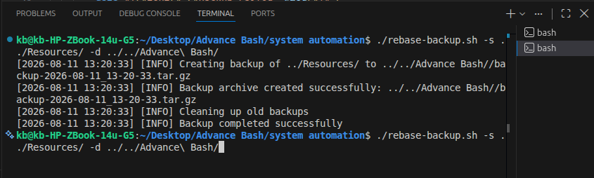
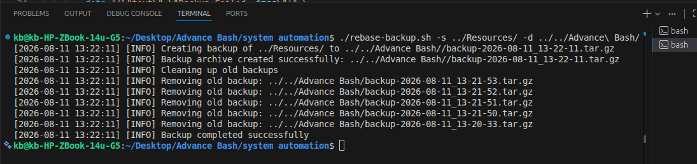

# DEMO

This document provides a simple walkthrough for demonstrating the Bash-based system automation project.

## Demo Objective

Show how a collection of Bash scripts can automate common Linux administration tasks in a clear and repeatable way.

## Step 1: Project Overview

The first part of the demo should introduce the purpose of the project and highlight the main automation areas.



## Step 2: Explain the Workflow

Walk through the typical process of running a system automation task:

1. Prepare the environment
2. Execute the script
3. Review the output
4. Store or schedule the task for future runs



## Step 3: Run a Basic Script

Use a simple command to demonstrate script execution.

```bash
./scripts/system-check.sh
```
